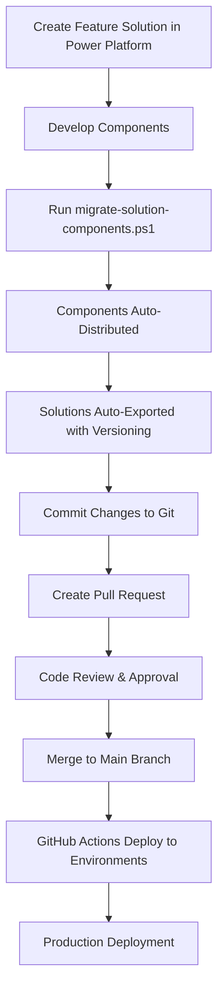

# Core Project - Power Platform Solutions

This repository contains the core Power Platform solutions for the project, including automated deployment workflows and solution management scripts.

## 🏗️ Solution Architecture

This project manages multiple Power Platform solutions organized in separate folders:

### 📁 Solution Folders Structure

```
├── main/                  # Main application solution
│   ├── managed/          # Managed solution exports
│   └── unmanaged/        # Unmanaged solution exports (source control)
├── flows/                # Power Automate flows solution
│   ├── managed/          # Managed flow exports
│   └── unmanaged/        # Unmanaged flow exports (source control)
├── webresources/         # Web resources solution
│   ├── managed/          # Managed web resource exports
│   └── unmanaged/        # Unmanaged web resource exports (source control)
└── .github/workflows/    # GitHub Actions deployment pipelines
```

### 🔧 Solution Components

#### Main Solution (`main`)
- **HousingUnit** (`cicd_housingunit`) - Manages housing unit information
- **Lease** (`cicd_lease`) - Handles lease agreements and contracts  
- **Tenant** (`cicd_tenant`) - Stores tenant information and details
- **App Modules** - Core application modules and site maps
- **Relationships** - Entity relationships and business logic

#### Flows Solution (`flows`)
- **AddTenantwhenhousingunitadded** - Automated tenant creation workflow
- **CreateContactWhenAccountCreated** - Contact creation automation

#### WebResources Solution (`webresources`)
- **cicd_mzh_accountform** - Account form customizations
- **cicd_contactform** - Contact form web resources

## 🚀 Developer Onboarding Guide

### Prerequisites
- **Git** - Version control system
- **Power Platform CLI** - Microsoft Power Platform command-line interface
- **PowerShell 5.1+** - For running automation scripts
- **MSAL.PS Module** - For Azure AD authentication (`Install-Module MSAL.PS`)
- **Visual Studio Code** (recommended) - Code editor with Power Platform extensions

### 📋 Development Workflow

#### 1. Repository Setup
```bash
# Clone the repository
git clone https://github.com/mziaulhaqz89/core.git
cd core

# Pull the latest main branch
git checkout main
git pull origin main
```

#### 2. Create Development Branch
```bash
# Create a new feature branch
git checkout -b feature/your-feature-name
```

## 🔄 End-to-End Development Process

### Phase 1: Feature Development

#### 3.1 Create Feature Solution in Power Platform
1. **Create Development Solution**: Create a temporary "feature" solution in your Power Platform environment
2. **Add Components**: Add all new entities, workflows, web resources, or other components to this feature solution
3. **Develop & Test**: Build your features within this isolated solution

#### 3.2 Component Migration (Automated)

When your feature is ready, use the **Component Migration Script** to automatically distribute components to the correct target solutions:

```powershell
# Run the component migration script
.\migrate-solution-components.ps1
```

**What the Migration Script Does:**

1. **🔐 Authentication**: Interactive Azure AD login using MSAL.PS
2. **📋 Component Discovery**: Retrieves all components from your feature solution
3. **🎯 Smart Distribution**: Automatically maps components to target solutions:
   - **Entities** → `main` solution
   - **Processes/Flows** → `flows` solution  
   - **Web Resources** → `webresources` solution
   - **Connection References** → `connectionreference` solution
   - **Plugins/SDK Messages** → `plugins` solution

4. **📊 Beautiful Display**: Shows migration mapping in formatted tables
5. **✅ Automated Migration**: Uses PAC CLI to migrate components
6. **📈 Impact Summary**: Reports which target solutions were affected
7. **🚀 Auto-Export**: Optionally exports updated solutions with version increment
8. **🗑️ Cleanup**: Offers to delete the temporary feature solution

#### 3.3 Solution Export & Versioning

After migration, the script can automatically export solutions, or you can run the export script manually:

```powershell
# Export specific solutions with versioning
.\export-solution.ps1 -SolutionName "main" -VersionType "minor"
.\export-solution.ps1 -SolutionName "flows" -VersionType "patch"
.\export-solution.ps1 -SolutionName "webresources" -VersionType "patch"
```

**What the Export Script Does:**

1. **🔍 Version Check**: Retrieves current solution version from Power Platform
2. **⬆️ Version Increment**: Automatically increments version (patch, minor, or major)
3. **🔄 Version Update**: Updates the solution version in Power Platform
4. **📦 Dual Export**: Exports both managed and unmanaged versions
5. **📂 Unpack & Organize**: Unpacks solutions into organized folder structure
6. **🧹 Cleanup**: Removes temporary .zip files

### Phase 2: Source Control Integration

#### 4.1 Review Changes
```bash
# Check what files were modified/added
git status
git diff
```

#### 4.2 Commit Changes
```bash
# Stage your changes
git add .

# Commit with descriptive message following conventional commits
git commit -m "feat: add tenant auto-creation workflow for housing units"
git commit -m "fix: resolve validation issue in lease entity form"
git commit -m "refactor: optimize web resource loading for account forms"
```

#### 4.3 Push and Create Pull Request
```bash
# Push to your feature branch
git push origin feature/your-feature-name

# Create pull request to main branch (via GitHub UI)
```

### Phase 3: Automated Deployment

#### 5.1 Deployment Pipeline
Once your PR is approved and merged to `main`:

- **GitHub Actions** automatically detect solution changes
- **Targeted Deployment**: Only deploys solutions that have changed
- **Environment Progression**: DEV → TEST → PROD (configurable)

#### 5.2 Available Deployment Workflows
- **`02-deploy-main-solution.yml`** - Deploys entity and core logic changes
- **`03-deploy-flows-solution.yml`** - Deploys Power Automate workflows
- **`04-deploy-webresources-solution.yml`** - Deploys web resources and customizations

## 🛠️ Advanced Workflows & Scripts

### Available PowerShell Scripts

#### 1. Component Migration Script (`migrate-solution-components.ps1`)
**Purpose**: Intelligent distribution of solution components from feature solutions to target solutions

**Key Features:**
- 🎯 **Smart Component Mapping**: Automatically routes components to correct solutions
- 🔐 **Secure Authentication**: Uses MSAL.PS for Azure AD integration
- 📊 **Beautiful UI**: Professional table formatting with Unicode characters
- 📈 **Impact Tracking**: Shows which solutions are affected by the migration
- 🚀 **Export Integration**: Can automatically export updated solutions
- 🗑️ **Cleanup Options**: Offers to delete feature solution after successful migration

**Usage:**
```powershell
.\migrate-solution-components.ps1
# Interactive script - follow the prompts
```

#### 2. Solution Export Script (`export-solution.ps1`)
**Purpose**: Automated versioning and export of Power Platform solutions

**Key Features:**
- 📦 **Dual Export**: Creates both managed and unmanaged versions
- 🔢 **Smart Versioning**: Patch/Minor/Major version increment options
- 📂 **Auto-Organization**: Unpacks solutions into structured folders
- 🧹 **Clean Process**: Removes temporary files automatically

**Usage:**
```powershell
# Basic export with patch increment
.\export-solution.ps1 -SolutionName "main"

# Export with specific version type
.\export-solution.ps1 -SolutionName "flows" -VersionType "minor"
```

#### 3. Contact Retrieval Script (`get-contacts.ps1`)
**Purpose**: Retrieves and displays contacts from Dynamics 365 environment

**Usage:**
```powershell
.\get-contacts.ps1
```

### 🔄 Complete Development Lifecycle



### Deployment Triggers
- **Manual**: Use GitHub Actions UI to trigger deployments
- **Automatic**: Deployments trigger on push to `main` branch when solution files change
- **Scheduled**: Optional scheduled deployments for maintenance windows

## 🛠️ Development Best Practices

### Version Management
- **Patch** (x.x.X) - Bug fixes, minor changes, configuration updates
- **Minor** (x.X.0) - New features, component additions, workflow updates  
- **Major** (X.0.0) - Breaking changes, major architectural updates, schema changes

### Branch Strategy
- **`main`** - Production-ready code, protected branch
- **`feature/*`** - Feature development branches
- **`hotfix/*`** - Critical bug fixes for production
- **`release/*`** - Release preparation branches

### Solution Management Best Practices

#### Component Organization
- **Entities & Core Logic** → `main` solution
- **Automation & Workflows** → `flows` solution
- **UI Customizations** → `webresources` solution
- **Integration Components** → `connectionreference` solution
- **Custom Code** → `plugins` solution

#### Development Workflow
1. **Always use feature solutions** for development (temporary containers)
2. **Never develop directly** in target solutions (`main`, `flows`, etc.)
3. **Use migration script** to distribute components properly
4. **Export regularly** to keep source control updated
5. **Test migrations** in development environment first

#### Source Control Guidelines
- **Unmanaged solutions** are the source of truth for version control
- **Managed solutions** are deployment artifacts (auto-generated)
- **Commit frequently** with meaningful messages
- **Use conventional commit format**: `feat:`, `fix:`, `refactor:`, etc.

### 🚨 Important Workflow Notes

#### Do's ✅
- Create temporary feature solutions for development
- Use the migration script for component distribution
- Test in development environment before committing
- Follow semantic versioning for solution exports
- Keep commits atomic and well-documented

#### Don'ts ❌
- Don't develop directly in target solutions
- Don't manually move components between solutions
- Don't commit without testing the migration process
- Don't skip version increments for exports
- Don't delete feature solutions before confirming successful migration

## 🆘 Troubleshooting Guide

### Common Issues & Solutions

#### 1. Authentication Issues

**Problem**: MSAL.PS authentication failures
```powershell
# Solution: Install/Update MSAL.PS module
Install-Module MSAL.PS -Force -AllowClobber
Import-Module MSAL.PS -Force

# Clear any cached tokens
Get-MsalToken -ClientId "51f81489-12ee-4a9e-aaae-a2591f45987d" -Authority "https://login.microsoftonline.com/common" -Scopes @("https://mzhdev.crm4.dynamics.com/.default") -ClearCache
```

**Problem**: PAC CLI authentication issues
```bash
# Solution: Re-authenticate with Power Platform CLI
pac auth clear
pac auth create --url https://your-environment.crm4.dynamics.com

# List available auth profiles
pac auth list
```

#### 2. Script Execution Issues

**Problem**: PowerShell execution policy errors
```powershell
# Solution: Set execution policy (run as Administrator)
Set-ExecutionPolicy -ExecutionPolicy RemoteSigned -Scope CurrentUser

# Or bypass for single script
powershell -ExecutionPolicy Bypass -File .\migrate-solution-components.ps1
```

**Problem**: Script encoding issues
```powershell
# Solution: Fix file encoding
Get-Content .\export-solution.ps1 -Encoding UTF8 | Set-Content .\export-solution.ps1 -Encoding UTF8
```

#### 3. Solution & Component Issues

**Problem**: Target solutions not found during migration
- ✅ **Verify** target solutions exist in your Power Platform environment:
  - `main`, `flows`, `webresources`, `connectionreference`, `plugins`
- ✅ **Create missing solutions** in Power Platform admin center
- ✅ **Check solution names** are exactly as expected (case-sensitive)

**Problem**: Component migration fails
- ✅ **Ensure** you have System Administrator role in the environment
- ✅ **Verify** feature solution contains the components you expect
- ✅ **Check** component dependencies are resolved
- ✅ **Try** migrating components one type at a time

**Problem**: Solution export hangs or fails
- ✅ **Check** solution doesn't have unresolved dependencies
- ✅ **Verify** you have export permissions
- ✅ **Try** exporting smaller solution subsets first
- ✅ **Ensure** no other users are modifying the solution

#### 4. Environment & Connectivity Issues

**Problem**: Web API calls timeout
```powershell
# Solution: Check environment URL and connectivity
$testUrl = "https://your-environment.crm4.dynamics.com/api/data/v9.0/WhoAmI"
Invoke-WebRequest -Uri $testUrl -Method Get
```

**Problem**: Git operations fail
```bash
# Solution: Check repository connection and credentials
git remote -v
git status
git config --list
```

### 🔧 Diagnostic Commands

#### Quick Environment Check
```powershell
# Check PowerShell modules
Get-Module -ListAvailable MSAL.PS
Get-Module -ListAvailable Microsoft.PowerApps.Administration.PowerShell

# Check PAC CLI
pac --version
pac auth list

# Test Power Platform connectivity
pac solution list
```

#### Debug Migration Issues
```powershell
# Enable verbose output in migration script
$VerbosePreference = "Continue"

# Check solution component counts
pac solution show --solution-name "your-feature-solution"
```

### 📞 Getting Help

#### Self-Service Resources
1. **Check script output** - Scripts provide detailed error messages
2. **Verify prerequisites** - Ensure all required modules are installed
3. **Test connectivity** - Use diagnostic commands above
4. **Check permissions** - Verify you have appropriate Power Platform roles

#### Escalation Process
1. **Document the issue** with error messages and steps to reproduce
2. **Check existing GitHub Issues** for similar problems
3. **Create new GitHub Issue** with:
   - Environment details
   - Error messages
   - Steps to reproduce
   - Screenshots if applicable

## 📞 Support

For questions or issues:
1. Check existing GitHub Issues
2. Create new issue with detailed description
3. Contact the development team

## 🔗 Useful Links

- [Power Platform CLI Documentation](https://docs.microsoft.com/en-us/power-platform/developer/cli/introduction)
- [Solution Concepts](https://docs.microsoft.com/en-us/power-platform/alm/solution-concepts-alm)
- [GitHub Actions for Power Platform](https://github.com/microsoft/powerplatform-actions)
- [MSAL.PS Documentation](https://github.com/AzureAD/MSAL.PS)
